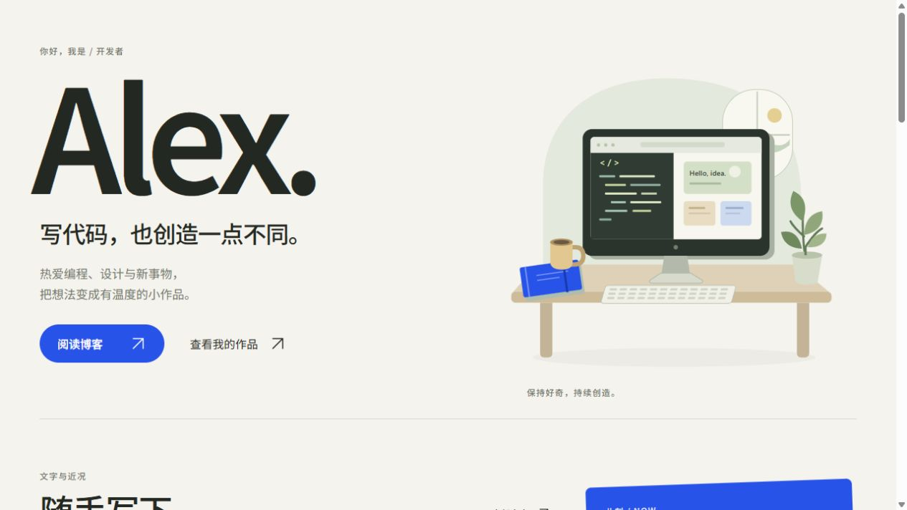
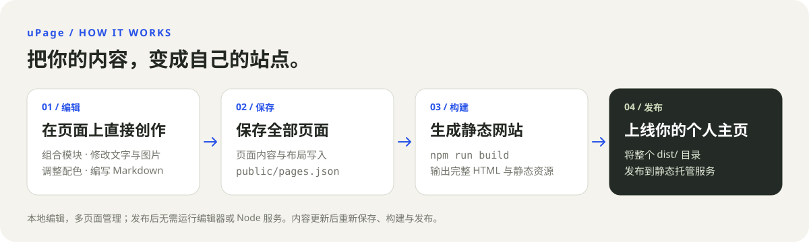
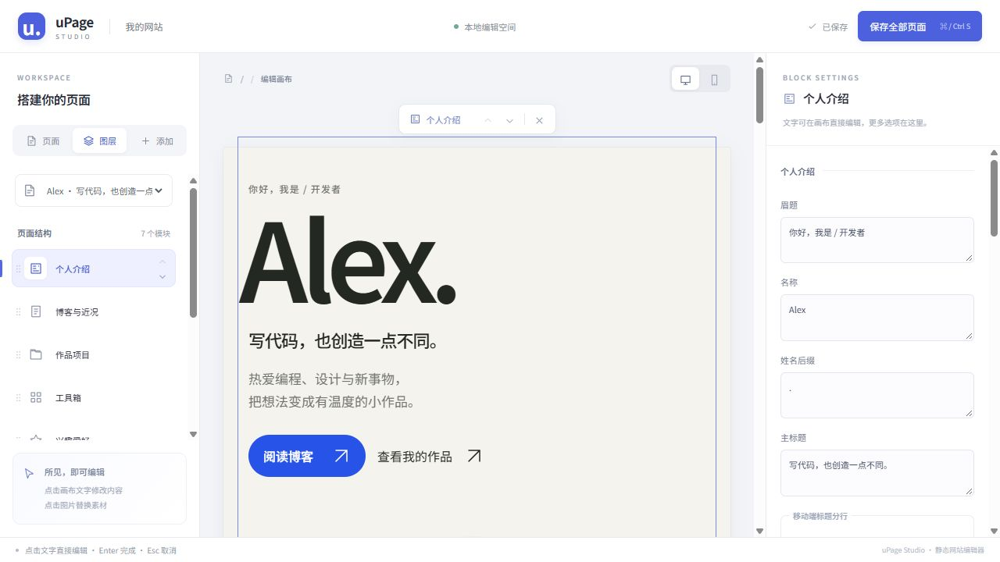
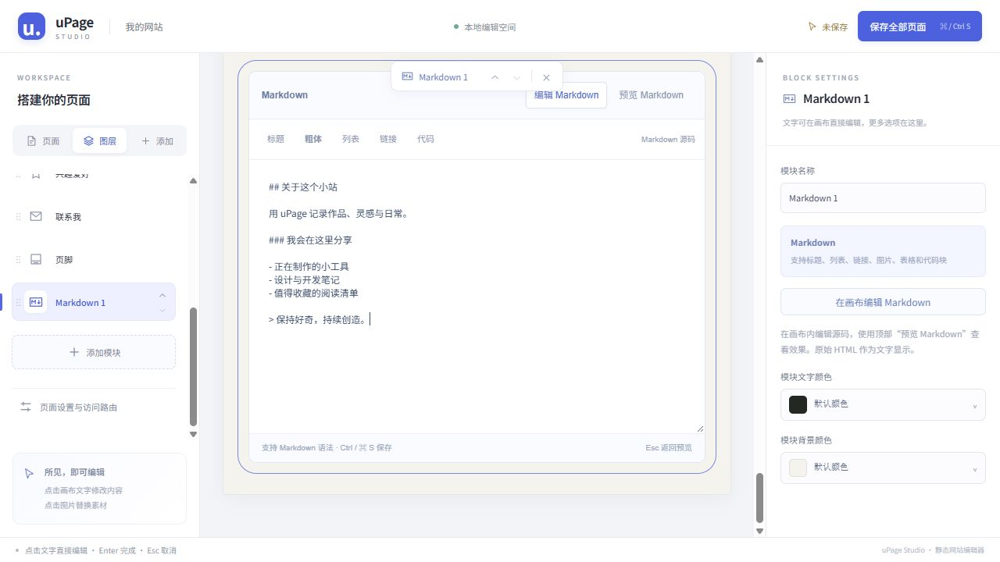

# uPage

一个可以在页面上直接编辑的个人主页生成器。基于 Vue 3、TypeScript 和 Vite，提供本地可视化后台、可组合的内容模块和多页面管理；保存后构建为完全静态的网站。

采用暖白、炭黑与钴蓝的默认视觉风格，支持自定义文字、图片、配色和页面布局。项目使用 [0BSD 开源协议](LICENSE)。

**AI 协作说明：本项目由人类提出需求、选择设计并验收，AI（ChatGPT / Codex）协助完成界面设计、代码实现、测试与文档。** 这是开发方式说明，不构成额外的署名或使用条件。

## 项目预览

以下为项目运行时的实际截图，使用可替换的示例内容。点击图片可查看原图。

### 桌面端主页

大字号个人介绍、原创工作台插画，以及博客、作品和个人内容模块，组成自己的主页。

[](docs/images/homepage-desktop.jpg)

<details>
<summary>查看手机端主页</summary>

窄屏下内容自动纵向排列，个人介绍、按钮和插画保持清晰的阅读顺序。

<p align="center">
  <a href="docs/images/homepage-mobile.jpg"></a>
</p>

</details>

### 从编辑到发布



在本地编辑并保存内容，再构建、发布整个 `dist/` 目录。支持多页面与独立路由，发布后的页面无需运行编辑器。

## 快速开始

需要 **Node.js 22.18 或更高版本**，以及 npm。

```sh
git clone https://github.com/uMisty/uPage.git
cd uPage
npm install
npm run editor
```

浏览器会自动打开编辑器，默认地址为 `http://127.0.0.1:4173/__edit/`，实际地址以终端输出为准。

1. 在左侧选择页面，添加模块或调整顺序。
2. 点击画布中的文字、图片或 Markdown 内容进行编辑。
3. 在右侧调整详细内容、颜色和页面访问路由。
4. 点击“保存全部页面”，或按 `Ctrl+S`（macOS 为 `Cmd+S`）。
5. 构建并检查最终网站：

```sh
npm run build
npm run preview
```

将生成的 **`dist/` 整个目录**发布到静态托管服务即可。修改内容后，需要再次保存、构建和发布。

## 可视化编辑器

编辑器采用三栏布局：左侧管理页面与模块，中间是可直接编辑的画布，右侧提供当前选中内容的详细设置。

[](docs/images/editor.jpg)

### 页面与布局

- **页面**：切换页面；新建页面会复制当前页面的内容与布局，之后可独立编辑。
- **图层**：查看模块顺序，拖动手柄或使用上下箭头排序。
- **添加**：搜索模块库并插入模块。
- **画布工具栏**：移动或移除当前模块，切换桌面与窄屏预览。
- **页面设置**：调整标题、描述、语言、配色和访问路由。

每个页面拥有独立内容和布局。内置模块每页可添加一次；移除后保留内容，重新添加即可恢复。Markdown 模块可以重复添加，每个实例独立编辑和排序，删除实例时同时删除其内容。

### 文字、图片与颜色

点击画布中可编辑的文字即可输入，按 Enter 或移开焦点完成修改，Esc 取消本次文字输入。列表条目支持在右侧添加、删除和排序。

点击图片后，可在右侧替换地址或上传文件。支持 PNG、JPEG、WebP、GIF、AVIF，单张最大 **12 MB**。上传的文件立即写入 `public/assets/uploads/`，页面内容仍需点击保存。图片也可以使用 `/assets/example.webp` 这样的站内路径或完整 HTTP(S) 地址。

颜色设置提供**拾色器、常用色板和手动 HEX 输入**，支持 `#RRGGBB` 与三位简写，输入后按 Enter 或移开焦点应用。可以修改页面默认配色，也可以选中文字后单独设置颜色或恢复默认。

工具箱的图标还支持 **Iconify 图标库**：点击工具图标，或进入工具条目设置，将“图标来源”切换为图标库，即可按英文名称搜索并预览选择 **Lucide** 通用图标或 **Simple Icons** 品牌图标。也可随时切回图片上传、图片地址或替代文字。图标数据随项目安装，构建时直接输出内联 SVG，无需访问在线图标接口。手动配置时，`toolGroups[].items[].icon` 可填写 `lucide:code`、`simple-icons:vuedotjs` 等库内标识。

### Markdown 编辑

添加 Markdown 模块后，点击模块内容或对应图层，画布会切换为 Markdown 源码编辑器并聚焦输入框。工具栏可插入标题、粗体、列表、链接和代码语法。

支持标题、列表、引用、链接、图片、表格、代码块等常用语法。点击“预览 Markdown”或按 Esc 切回渲染结果，再次点击即可继续编辑；这里的 Esc 仅切换预览，不撤销内容。右侧可以修改模块名称、文字色和背景色。

[](docs/images/markdown-editor.jpg)

原始 HTML 按文字显示，危险链接协议会被拒绝。Markdown 内容在构建时渲染为 HTML，发布后无需浏览器运行 Markdown 编辑器或解析器。

### 保存机制

“保存全部页面”会将所有页面写入 `public/pages.json`。首次使用且该文件不存在时，从 `public/site.config.json` 导入初始页面；保存后，以 `pages.json` 为准。离开有未保存修改的页面时会提示。

后台仅在 `npm run editor` 时启用，默认只监听本机。它是本地创作工具，没有在线账号或多人协作功能。静态发布的网站不提供编辑器入口和保存接口。

## 模块库

共提供 **12 种内置模块和可重复添加的 Markdown 模块**。新增模块按需添加，不会自动改变已有页面。

| 模块 | 可编辑内容与用途 |
| --- | --- |
| 个人介绍 | 姓名、介绍、简介、座右铭、首屏图片与按钮文案 |
| 作品项目 | 项目封面、摘要、标签、发布日期、Demo 与 GitHub 链接 |
| 博客与近况 | RSS 文章列表与个人近况，二者可独立开关 |
| 工具箱 | 工具分类、图标、名称、用途与链接 |
| 兴趣爱好 | 兴趣介绍与配图 |
| 联系我 | 邮箱和桌面、移动端联系文案 |
| 页脚 | 页脚文字与链接 |
| 经历时间线 | 工作、教育、创作经历，包含时间段、组织、介绍和链接 |
| 精选文章 | 手动编排文章或系列入口，包含标题、日期、分类、摘要和链接 |
| 相册画廊 | 摄影与插画，包含图片、替代文字、说明和可选链接 |
| 友链收藏 | 朋友、博客与资源推荐，包含图标、名称、介绍和链接 |
| 常见问题 | 可折叠的问答，使用原生控件，禁用 JavaScript 也可展开 |
| Markdown | 可重复添加的自由内容区域，各自保存内容与配色 |

作品项目优先从标记为 `featured` 的项目中选取发布日期最新的一项作为主推；没有标记时，从全部项目中选择。Demo 与 GitHub 链接分别显示，缺少时不生成空链接。

“精选文章”独立于 RSS，可以链接到站内页面。创建一个如 `/notes/hello/` 的页面，添加 Markdown 正文，再在精选文章中填写该路径，即可组织静态博客文章。

## 多页面与静态发布

在页面设置中填写访问路由，例如：

| 访问路由 | 构建文件 |
| --- | --- |
| `/` | `dist/index.html` |
| `/about/` | `dist/about/index.html` |
| `/notes/hello/` | `dist/notes/hello/index.html` |

路由以 `/` 开头和结尾，每段可使用英文字母、数字、连字符与下划线。必须保留首页 `/`；不允许重复路由（包括大小写冲突）或系统保留路径。

`npm run build` 会先检查类型，再构建资源，并为每个页面生成包含完整正文、元信息和样式的 HTML。RSS 文章也会在构建时读取并写入页面。生成的页面无需 JavaScript 即可阅读，不依赖运行时 API 或 Node 服务。

部署时注意：

- 发布完整 `dist/`，托管服务需支持目录下的 `index.html`。
- 部署到域名根路径；目前不支持将整站挂载到 `/upage/` 等子目录。页面本身可以使用嵌套路由。
- 不需要 SPA 路由回退。
- 内容与 RSS 的更新都需要重新构建，可通过 CI 定期构建和发布。
- 本地图片与字体随资源发布；使用远程图片地址时，图片仍从对应网站加载。

`npm run build:static` 是 `npm run build` 的别名。

## 博客订阅

在“博客与近况”中设置博客首页、订阅地址和展示数量。支持 **RSS 2.0、RSS 1.0 / RDF 和 Atom**，按发布时间排序、按链接去重，展示数量为 1–20 篇。

默认 `/feed.xml` 是本地示例订阅，包含虚构文章，正式使用时请替换。例如，页面配置中的 `blog` 可设置为：

```json
{
  "enabled": true,
  "url": "https://your-blog.example",
  "feedUrl": "https://your-blog.example/feed.xml",
  "mode": "server",
  "limit": 3,
  "cacheMinutes": 10,
  "showReadingTime": true,
  "defaultCategory": "随笔"
}
```

本地开发默认由同源服务读取订阅，避免浏览器跨域限制；编辑器按当前设置预览。手动设置 `mode: "direct"` 时，订阅源需允许浏览器跨域读取或与页面同源。

阅读时长根据订阅正文或摘要估算，可关闭。服务端有缓存、请求超时与大小限制，并限制私网地址访问。静态构建会将订阅结果固化到 HTML，发布后不会自动轮询 RSS；无法获取可用订阅时会报错，需要检查地址或网络后重新构建。

## 内容文件与开发

通常直接使用可视化编辑器即可，也可以手动维护配置。

| 文件或目录 | 用途 |
| --- | --- |
| `public/pages.json` | 编辑器保存的全部页面：路由、布局与内容，存在时优先使用 |
| `public/site.config.json` | 初始单页配置；尚无 `pages.json` 时使用 |
| `public/site.schema.json` | 单页配置的 JSON Schema 编辑提示 |
| `public/assets/` | 图片、图标等静态素材；上传文件位于 `uploads/` |
| `shared/` | 配置校验、页面模型、模块定义与 Markdown 处理 |
| `src/components/` | 前端页面与内容模块 |
| `src/editor/` | 可视化编辑器、字段面板和画布交互 |
| `src/render-static.ts` | 页面服务端渲染入口 |
| `server/` | 本地编辑、上传、保存与 RSS 服务 |
| `scripts/build-static.ts` | 多路由静态 HTML 生成 |
| `tests/` | 单元与浏览器测试 |

每页配置包含 `site`、`theme`、`profile`、`sections`、`labels`、`projects`、`blog`、`now`、`toolGroups`、`interests`、`contact`，以及新增模块的 `timeline`、`articles`、`gallery`、`links`、`faq`。Markdown 实例保存在 `markdownBlocks`，单段文字颜色保存在 `textColors`；模块排列保存在页面的 `layout` 中。

### 常用命令

| 命令 | 用途 |
| --- | --- |
| `npm run editor` | 启动本地编辑器，默认端口 4173 |
| `npm run dev` | 启动前端开发服务，默认端口 5173 |
| `npm run build` | 类型检查并生成所有静态页面 |
| `npm run preview` | 本地预览构建产物 |
| `npm run typecheck` | TypeScript 类型检查 |
| `npm run schema` | 根据配置模型更新 JSON Schema |
| `npm test` | 运行单元测试 |
| `npm run test:e2e` | 运行前端浏览器测试 |
| `npm run test:editor` | 运行编辑器、保存与静态构建浏览器测试 |
| `npm start` | 可选的 Node 静态文件与 RSS 服务，默认端口 3000 |

浏览器测试默认使用本机 Microsoft Edge。编辑器测试当前还需要安装 pnpm，用于启动独立测试服务。其他浏览器环境可调整 `playwright.config.ts` 和 `playwright.editor.config.ts` 的 `channel`，并通过 `npx playwright install chromium` 安装 Chromium。

`npm start` 需先构建，并保留 `server/`、`shared/`、`dist/`、`package.json` 和运行依赖；支持 `HOST`、`PORT` 环境变量。纯静态托管不需要此服务。

## 设计与素材

- [设计说明与响应式规则](design/README.md)
- [桌面端原稿](design/profile-desktop-demo.png) / [移动端原稿](design/profile-mobile-demo.png)
- [Figma 分层源与验收记录](design/figma-package/README.md)
- [项目图标预览](design/upage-icons.png) / [SVG 源文件](public/assets/upage-icon.svg) / [PNG](public/assets/upage-icon.png)
- [品牌图标来源](public/assets/ICON-SOURCES.md)

默认模板中的人物、项目、文章、邮箱和示例链接用于展示，请替换为自己的内容。页面使用本地打包的 Noto Sans SC 字体，支持响应式布局、键盘焦点与减少动态效果偏好。

## 开源协议

项目代码及未单独声明许可的原创素材采用 **Zero-Clause BSD（SPDX：`0BSD`）**。允许使用、复制、修改和分发，也可用于商业用途；软件按原样提供，不作担保。完整条款见 [LICENSE](LICENSE)，协议说明见 [OSI 0BSD 页面](https://opensource.org/license/0bsd)。

第三方内容保留各自许可：

- Simple Icons 品牌图标：[CC0 1.0 许可](public/assets/ICON-LICENSE.md)与[来源说明](public/assets/ICON-SOURCES.md)，相关商标归各权利人所有。
- Noto Sans SC 字体：[SIL Open Font License 1.1](public/assets/FONT-LICENSE.txt)。
- Lucide 图标：[ISC 许可及部分源自 Feather 图标的 MIT 许可](public/assets/LUCIDE-LICENSE.txt)，许可文件随静态资源发布；Iconify Vue 组件遵循其 MIT 许可。新增 Simple Icons 图标集同样遵循上方 CC0 许可。
- 第三方依赖遵循各自的软件许可。

用户自行添加的文字、图片及外部 RSS 内容，不会因使用本项目而自动改为 0BSD 授权。
